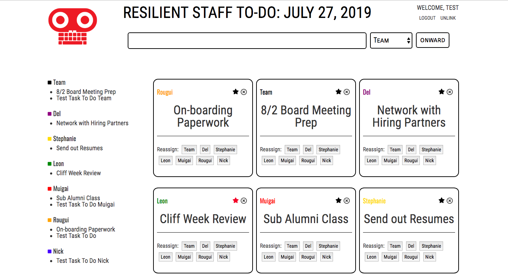

# Task Manager Full-stack App

### Goal: Create a task manager where users can assign / reassign tasks to team members as well as favorite and delete.

## Design and Development:
**Tech Used** HTML, CSS, JavaScript, Node, Express, EJS template, MongoDB, User Authentication:
Using Node, Express, JS, and MongoDB to store and access data, this app allows users to assign tasks to other team members. Through the PUT method, users are also able to star their tasks or reassign them. Tasks are displayed as notes and in a list under team members' names. Notes can be easily differentiated by team members' names being distinct colors.  

## Reflections:
It was so fun to build an app that's similar to something I use every day! There are a few places where the code can be more DRY (such as for loops in EJS) but will keep that in mind for next application.

## Installation
1. Clone repo
2. run `npm install`

## Usage
1. run `node server.js`
2. Navigate to `localhost:3330`

## Credit
Modified from Scotch.io's auth tutorial
<<<<<<< HEAD

## Important
create database.js file with:
module.exports = {

    'url' : '<db connect link>', // looks like mongodb://<user>:<pass>@mongo.onmodulus.net:27017/Mikha4ot
    'dbName': '<yourDbName>'
};
=======
>>>>>>> 44b5f9a5c006119dcefea24040ce1f8dbfc32b30
